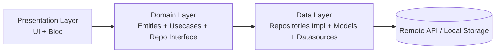
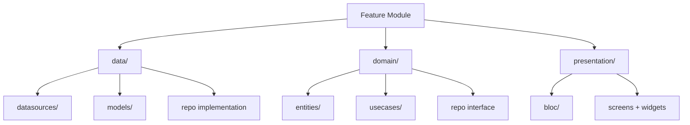

# Flutter Base Template


## 1. Khởi tạo Project từ Template

### Bước 1: Tạo project mới từ template

* Chọn **“Use this template”** từ repo `flutter_base` trên GitHub.
* Docs tham khảo: [https://docs.github.com/en/repositories/creating-and-managing-repositories/creating-a-repository-from-a-template](https://docs.github.com/en/repositories/creating-and-managing-repositories/creating-a-repository-from-a-template)

### Bước 2: Chạy script khởi tạo

#### Tạo file env

```sh
chmod +x create_env.sh
./create_env.sh
```

#### Tạo file launch.json

```sh
chmod +x scripts/create_launch_json.sh
./scripts/create_launch_json.sh
```

#### Generate assets, g.dart models và retrofit API

```sh
chmod +x cmd
./cmd gen
```

### Bước 3: Đổi applicationId

* Tìm toàn bộ `com.inetkr.base` → thay bằng **applicationId mới của project**.

### Bước 4: Đổi tên app

* **Android:** chỉnh trong `android/app/build.gradle.kts`, tại phần `productFlavors` → `appname`
* **iOS:** chỉnh `APP_DISPLAY_NAME` trong `ios/Flutter/{env}.xcconfig`

⇒ Sau bước này, dự án đã sẵn sàng. Chạy app để kiểm tra.

---

## 2. Cấu trúc thư mục

```
lib/
├── core/          # Code dùng chung nhiều project
├── shared/        # Code dùng chung cho nhiều feature
├── resources/     # Theme, typography, dimensions, localization, assets gen
└── features/      # Mỗi feature theo Clean Architecture
    ├── data/      # Datasource, raw model, repo implement
    ├── domain/    # Entity, usecase, repo interface
    └── presentation/ # Bloc, UI
```

### 🧱 Clean Architecture Overview

## Clean Architecture (3 layers)



---

## Feature Structure Diagram



---

## 3. Demo Tính Năng Authentication

Sử dụng sample API: [https://dummyjson.com/docs](https://dummyjson.com/docs)

Ví dụ API login:

```http
POST https://dummyjson.com/auth/login
```

Tích hợp theo flow:

* `data` → Retrofit request
* `domain` → Usecase xử lý logic
* `presentation` → Bloc quản lý state UI

---

## 4. Script hỗ trợ

### Generate toàn bộ asset và API:

```sh
./cmd gen
```

---

# 🎯 Mục tiêu Template

* Setup dự án trong **1 phút**
* Tuân thủ Clean Architecture chuẩn
* Dễ mở rộng theo feature
* Tự động hóa mọi công đoạn build generator
* Dễ onboard developer mới

---

# 🤝 Đóng góp

Pull Request & Issue được chào đón.

---

# 📄 License

MIT.